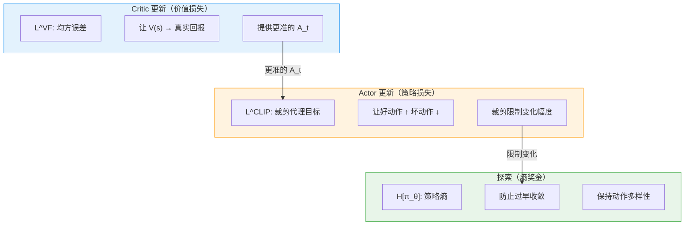

# 7.2 PPO 数学推导——从策略梯度到裁剪代理目标

上一节我们用 SB3 的 PPO 训练了月球着陆器，看到了训练曲线和关键指标。但 PPO 的公式是怎么来的？为什么它比朴素策略梯度更稳定？这一节我们从头推导 PPO 的完整数学原理，把第 5 章的策略梯度、重要性采样、裁剪机制串成一条完整的链条。

推导路线图：

```
策略梯度 → 带基线的策略梯度 → 代理目标（Surrogate Objective）→ TRPO（KL 约束）→ PPO-Clip（裁剪）
```

公式中出现的符号含义如下：

| 符号                         | 含义                                     | 学术名称                  |
| ---------------------------- | ---------------------------------------- | ------------------------- |
| $\pi_\theta(a \mid s)$       | 策略网络在状态 $s$ 下选择动作 $a$ 的概率 | Policy / 策略             |
| $\pi_{\text{old}}(a \mid s)$ | 上一次收集数据时的策略                   | Old Policy / 旧策略       |
| $A_t$                        | 时刻 $t$ 的优势估计                      | Advantage / 优势函数      |
| $r_t(\theta)$                | 新旧策略的概率比值                       | Policy Ratio / 策略比率   |
| $\varepsilon$                | 裁剪范围，通常取 0.1 或 0.2              | Clip Range / 裁剪范围     |
| $V_\theta(s)$                | Critic 对状态 $s$ 的价值估计             | Value Function / 价值函数 |
| $H[\pi_\theta]$              | 策略的熵                                 | Entropy / 熵              |

## 第一步：策略梯度回顾

第 5 章我们推导了策略梯度定理。策略 $\pi_\theta$ 的目标函数是期望累计奖励：

$$J(\theta) = \mathbb{E}_{\tau \sim \pi_\theta} \left[ \sum_{t=0}^{\infty} \gamma^t r_t \right]$$

策略梯度定理告诉我们，目标函数对参数的梯度可以写成：

$$\nabla_\theta J(\theta) = \mathbb{E}_t \left[ \nabla_\theta \log \pi_\theta(a_t | s_t) \cdot \Psi_t \right]$$

其中 $\Psi_t$ 可以是累计回报 $G_t$、基线校正后的优势 $A_t$、或 TD Error $\delta_t$。选择 $\Psi_t = A_t$ 就是最常用的形式：

$$\nabla_\theta J(\theta) = \mathbb{E}_t \left[ \nabla_\theta \log \pi_\theta(a_t | s_t) \cdot A_t \right]$$

这就是 Actor-Critic 架构中 Actor 的更新方向——Critic 提供 $A_t$，Actor 沿着梯度调整 $\theta$。

回到 [ppo_from_scratch.py](../../code/chapter06_ppo/ppo_from_scratch.py) 中的代码，收集数据时模型记录了每个动作的 log 概率：

```python
# 收集数据时：记录旧策略的 log 概率
dist = Categorical(action_probs)
action = dist.sample()
log_prob = dist.log_prob(action)   # → log π_old(a|s)
```

这里的 `log_prob` 就是公式中的 $\log \pi_{\text{old}}(a_t | s_t)$，它会在后续 PPO 更新中被反复使用。

**朴素策略梯度的致命问题**。这个梯度估计的方差很大。一次基于 mini-batch 的梯度更新可能导致策略发生大幅变化，而策略更新是不可逆的——一旦参数变了，之前收集的数据就不再适用。在 [ppo_from_scratch.py](../../code/chapter06_ppo/ppo_from_scratch.py) 的 `collect_trajectories` 函数中，模型用当前策略跑 2048 步来收集数据。如果一次梯度更新就让策略大幅偏离，那这 2048 步数据全部作废——这在样本效率上是不可接受的。

要解决这个问题，核心矛盾在于：**我们想用同一批数据做多次更新（节省样本），但朴素策略梯度只能用一次**。为什么只能用一次？因为梯度公式中有一个隐含条件——数据必须来自当前策略 $\pi_\theta$。一旦 $\theta$ 更新了，旧数据对应的策略就不再是 $\pi_\theta$ 了。下一步的重要性采样将解开这个限制。

## 第二步：重要性采样——让旧数据重新可用

朴素策略梯度是**在线**（on-policy）的——必须用当前策略 $\pi_\theta$ 收集数据。能不能用旧策略 $\pi_{\theta_{\text{old}}}$ 收集的数据来更新新策略？可以，靠**重要性采样**。

### 2.1 重要性采样的恒等式

核心恒等式：对于任意函数 $f$，

$$\mathbb{E}_{a \sim \pi_\theta} [f(a)] = \mathbb{E}_{a \sim \pi_{\text{old}}} \left[ \frac{\pi_\theta(a|s)}{\pi_{\text{old}}(a|s)} \cdot f(a) \right]$$

这个等式为什么成立？展开左边：

$$\mathbb{E}_{a \sim \pi_\theta} [f(a)] = \sum_a \pi_\theta(a|s) \cdot f(a)$$

把 $\pi_\theta(a|s)$ 改写成 $\pi_{\text{old}}(a|s) \cdot \frac{\pi_\theta(a|s)}{\pi_{\text{old}}(a|s)}$：

$$= \sum_a \pi_{\text{old}}(a|s) \cdot \frac{\pi_\theta(a|s)}{\pi_{\text{old}}(a|s)} \cdot f(a) = \mathbb{E}_{a \sim \pi_{\text{old}}} \left[ \frac{\pi_\theta(a|s)}{\pi_{\text{old}}(a|s)} \cdot f(a) \right]$$

等式成立。**直觉**：我们想知道在"新世界" $\pi_\theta$ 下 $f$ 的期望值，但我们手里只有"旧世界" $\pi_{\text{old}}$ 的样本。解决方法是给每个样本加一个权重——新世界比旧世界更可能产生这个样本，权重就大于 1；反之小于 1。这个权重就是 $\frac{\pi_\theta}{\pi_{\text{old}}}$。

### 2.2 策略比率

定义**策略比率**（Policy Ratio）：

$$r_t(\theta) = \frac{\pi_\theta(a_t | s_t)}{\pi_{\text{old}}(a_t | s_t)}$$

在代码中，策略比率通过 log 概率之差的指数来计算，这是为了避免直接做除法导致数值下溢：

```python
# ppo_from_scratch.py 中的 ppo_clip_loss 函数
ratio = torch.exp(new_logprobs - old_logprobs)
# 即 r_t(θ) = exp(log π_θ - log π_old) = π_θ / π_old
```

$r_t = 1$ 表示新策略和旧策略在这个动作上概率相同；$r_t > 1$ 表示新策略更倾向于选这个动作；$r_t < 1$ 则相反。

### 2.3 代理目标

把重要性采样应用到策略梯度目标上，得到**代理目标**（Surrogate Objective）：

$$L^{\text{IS}}(\theta) = \mathbb{E}_t \left[ r_t(\theta) \cdot A_t \right]$$

展开写就是：

$$L^{\text{IS}}(\theta) = \mathbb{E}_t \left[ \frac{\pi_\theta(a_t | s_t)}{\pi_{\text{old}}(a_t | s_t)} \cdot A_t \right]$$

代码中对应：

```python
# 未裁剪的目标（即 L^IS）
surr1 = ratio * advantages
```

这个目标有一个重要性质——在 $\theta = \theta_{\text{old}}$ 处，它的一阶梯度等于朴素策略梯度：

$$\nabla_\theta L^{\text{IS}}(\theta) \bigg|_{\theta = \theta_{\text{old}}} = \nabla_\theta J(\theta)$$

验证这一点很简单：当 $\theta = \theta_{\text{old}}$ 时，$r_t = 1$，$\nabla_\theta r_t = \nabla_\theta \frac{\pi_\theta}{\pi_{\text{old}}} = \frac{\nabla_\theta \pi_\theta}{\pi_{\text{old}}}$，代入即可还原出策略梯度公式。

但**只要 $\theta$ 偏离 $\theta_{\text{old}}$，两者就会分叉**。偏离越远，代理目标就越不可靠——这就是下一步要解决的问题。

## 第三步：为什么要限制更新幅度？

代理目标 $L^{\text{IS}}(\theta) = \mathbb{E}_t [r_t(\theta) \cdot A_t]$ 本身没有上限。考虑一个具体的例子：

假设在某一步，动作 $a_t$ 的优势 $A_t = +2$（好动作），当前策略比率 $r_t = 5$（新策略选择该动作的概率是旧策略的 5 倍）。代理目标的值是 $5 \times 2 = 10$。如果我们继续增大 $\pi_\theta(a_t|s_t)$，让 $r_t$ 变成 10、50、100……代理目标的值可以无限增长——优化器会毫不犹豫地把这个概率推到接近 1。

但这是危险的。**当 $r_t$ 远离 1 时，重要性采样的方差急剧增大。** 原因在于：重要性权重 $r_t$ 是一个比值，当分母 $\pi_{\text{old}}$ 很小而分子 $\pi_\theta$ 很大时，$r_t$ 可以变得非常大。此时代理目标的估计完全被少数几个极端权重主导，梯度信号不再可靠。

更形式化地说，重要性采样估计量的方差正比于 $\mathbb{E}\left[\left(\frac{\pi_\theta}{\pi_{\text{old}}}\right)^2\right]$。当两个分布差异增大时，这个二阶矩会快速膨胀，导致梯度估计的方差爆炸——你看到的"梯度"可能只是噪声。

这就是 TRPO 和 PPO 要解决的核心问题：**找到一种方式，在优化代理目标的同时，限制策略的变化幅度。**

## 第四步：TRPO——KL 散度约束

TRPO（Trust Region Policy Optimization, Schulman et al. 2015）的做法是在约束条件下优化代理目标：

$$\max_\theta \; L^{\text{IS}}(\theta) \quad \text{s.t.} \quad \bar{D}_{\text{KL}}(\theta_{\text{old}}, \theta) \leq \delta$$

其中 $\bar{D}_{\text{KL}}$ 是平均 KL 散度，$\delta$ 通常取 0.01。

**KL 散度**度量两个概率分布之间的"距离"。在这里，它衡量的是新旧策略之间的差异程度：$\text{KL} = 0$ 表示两个策略完全相同，$\text{KL}$ 越大差异越大。$\delta = 0.01$ 意味着 TRPO 要求每一步更新后，新旧策略之间的 KL 散度不超过 0.01——这是一个很小的值，确保策略只做小幅调整。

TRPO 的求解方法是对代理目标做一阶泰勒展开、对 KL 约束做二阶泰勒展开，然后用共轭梯度法求解。理论上很漂亮，但工程上需要计算 Fisher 信息矩阵与向量的乘积（Hessian-vector product），实现复杂且计算昂贵。

**在 LLM 场景中**，这意味着要对一个数十亿参数的模型计算二阶导数信息——在工程上几乎不可行。这正是 PPO 被提出的原因：用一阶方法（普通梯度下降）达到 TRPO 类似的效果。

## 第五步：PPO-Clip——裁剪代理目标

PPO（Proximal Policy Optimization, Schulman et al. 2017）的核心思想：**不用约束优化，直接修改目标函数，让"过大的更新"不再被奖励。**

### 5.1 裁剪操作

PPO 引入了一个简单的 `clip` 操作：将策略比率 $r_t(\theta)$ 限制在 $[1-\varepsilon,\; 1+\varepsilon]$ 范围内：

$$\overline{r}_t(\theta) = \text{clip}(r_t(\theta), \; 1 - \varepsilon, \; 1 + \varepsilon)$$

当 $r_t$ 在 $[1-\varepsilon, 1+\varepsilon]$ 内时，$\overline{r}_t = r_t$（不裁剪）；当 $r_t$ 超出范围时，$\overline{r}_t$ 被截断到边界值。

在代码中：

```python
# 裁剪后的比率
surr2 = torch.clamp(ratio, 1.0 - clip_eps, 1.0 + clip_eps) * advantages
```

$\varepsilon$ 通常取 0.2。这意味着新策略选择某个动作的概率，最多是旧策略的 1.2 倍或最少是 0.8 倍——无论优化器怎么推，这个比率都被"天花板"和"地板"限制住了。

### 5.2 PPO-Clip 目标函数

PPO-Clip 的目标函数：

$$L^{\text{CLIP}}(\theta) = \mathbb{E}_t \left[ \min \left( r_t(\theta) \cdot A_t, \; \overline{r}_t(\theta) \cdot A_t \right) \right]$$

代码中对应：

```python
# 取两者中较小值（保守更新）
policy_loss = -torch.min(surr1, surr2).mean()
# 注意：代码中加了负号，因为我们要最小化损失（等价于最大化目标）
```

为什么要取 $\min$？$\min$ 操作确保目标函数是代理目标的**下界**（lower bound）。当策略比率 $r_t$ 在安全区间 $[1-\varepsilon, 1+\varepsilon]$ 内时，裁剪不生效，$\min$ 取未裁剪项，正常优化；当策略偏离太远时，下界变平，梯度变为零，更新自动停止。

### 5.3 分情况理解裁剪效果

**情况一：$A_t > 0$（好动作，应该增加概率）**

当 $A_t > 0$ 时，我们希望 $r_t$ 变大（即 $\pi_\theta$ 增加该动作的概率）。未裁剪项 $r_t \cdot A_t$ 会随 $r_t$ 线性增长，没有上限。裁剪项 $\overline{r}_t \cdot A_t$ 在 $r_t > 1+\varepsilon$ 后被截断为常数 $(1+\varepsilon) \cdot A_t$。

| $r_t$ 的范围               | 未裁剪项 $r_t \cdot A_t$ | 裁剪项 $\overline{r}_t \cdot A_t$   | $\min$ 取哪个    |
| -------------------------- | ------------------------ | ----------------------------------- | ---------------- |
| $r_t \leq 1 + \varepsilon$ | $r_t \cdot A_t$          | $r_t \cdot A_t$                     | 相等，正常优化   |
| $r_t > 1 + \varepsilon$    | $r_t \cdot A_t$（更大）  | $(1+\varepsilon) \cdot A_t$（常数） | 裁剪项，梯度为零 |

好动作的概率可以增加，但最多增到 $1 + \varepsilon$ 倍。超过之后目标函数"变平"——不再提供继续增大的动力，梯度为零，参数不会被进一步推动。

**情况二：$A_t < 0$（坏动作，应该降低概率）**

当 $A_t < 0$ 时，我们希望 $r_t$ 变小（即 $\pi_\theta$ 降低该动作的概率）。未裁剪项 $r_t \cdot A_t$ 会随 $r_t$ 减小而变得更负（乘以负数），看起来目标在"变好"。但 $r_t < 1-\varepsilon$ 后，裁剪项被截断为 $(1-\varepsilon) \cdot A_t$，此时未裁剪项比裁剪项更小，$\min$ 取未裁剪项——等等，未裁剪项更小不就是下界吗？

关键在于：当 $A_t < 0$ 且 $r_t < 1-\varepsilon$ 时，$r_t \cdot A_t > (1-\varepsilon) \cdot A_t$（因为 $r_t > 1-\varepsilon$ 时 $r_t \cdot A_t$ 更负，而负数更小意味着值更小）。具体来说：

| $r_t$ 的范围               | 未裁剪项 $r_t \cdot A_t$ | 裁剪项 $\overline{r}_t \cdot A_t$   | $\min$ 取哪个              |
| -------------------------- | ------------------------ | ----------------------------------- | -------------------------- |
| $r_t \geq 1 - \varepsilon$ | $r_t \cdot A_t$          | $r_t \cdot A_t$                     | 相等，正常优化             |
| $r_t < 1 - \varepsilon$    | $r_t \cdot A_t$（更负）  | $(1-\varepsilon) \cdot A_t$（常数） | 未裁剪项（更小），梯度为零 |

坏动作的概率可以降低，但最多降到 $1 - \varepsilon$ 倍。超过之后同样"变平"，$\min$ 选择未裁剪项（它更小），但由于 $r_t$ 的梯度在裁剪区域外为零（clip 操作的导数为零），所以梯度仍然为零。

**情况三：$A_t = 0$（中性动作）**。此时 $r_t \cdot A_t = 0$，无论 $r_t$ 如何变化，目标值始终为 0。PPO 对中性动作不做任何调整。

```python
import numpy as np
import matplotlib.pyplot as plt

# ==========================================
# PPO-Clip 目标函数的几何直觉
# ==========================================
epsilon = 0.2
r = np.linspace(0.0, 2.0, 500)

def clip_objective(r, A, eps=0.2):
    r_clipped = np.clip(r, 1 - eps, 1 + eps)
    return np.minimum(r * A, r_clipped * A)

fig, axes = plt.subplots(1, 3, figsize=(15, 4))

for ax, (A_val, title) in zip(axes, [
    (1.0, "A > 0 (好动作)"),
    (-1.0, "A < 0 (坏动作)"),
    (0.0, "A = 0 (中性动作)")
]):
    obj = clip_objective(r, A_val)
    ax.plot(r, r * A_val, 'b--', alpha=0.4, label='未裁剪 r·A')
    ax.plot(r, obj, 'r-', linewidth=2, label='PPO-Clip min(...)')
    ax.axvspan(1 - epsilon, 1 + epsilon, alpha=0.1, color='green', label='安全区间')
    ax.set_title(title)
    ax.set_xlabel('策略比率 r_t(θ)')
    ax.set_ylabel('目标值')
    ax.legend(fontsize=8)

plt.suptitle('PPO-Clip 目标函数的三种情况 (ε=0.2)', fontsize=13)
plt.tight_layout()
plt.savefig("ppo_clip_three_cases.png", dpi=150)
print("可视化已保存")
```

### 5.4 裁剪的直觉：安全护栏

把三种情况放在一起看，PPO-Clip 的设计意图就很清晰了：


$\varepsilon = 0.2$ 意味着每次更新后，策略选择某个动作的概率变化幅度不超过 $\pm 20\%$。这个"安全护栏"确保了即使梯度估计有噪声，策略也不会一步走太远。

## 第六步：PPO 的完整损失函数

实际训练中，PPO 的损失函数不只是裁剪代理目标，而是**三项之和**：

$$L(\theta) = L^{\text{CLIP}}(\theta) - c_1 \cdot L^{\text{VF}}(\theta) + c_2 \cdot H[\pi_\theta]$$

对应代码中的总损失计算：

```python
# 总损失 = 策略损失 + vf_coef * 价值损失 - ent_coef * 熵
loss = policy_loss + vf_coef * value_loss - ent_coef * entropy_bonus
```

### 6.1 策略损失（Policy Loss）$L^{\text{CLIP}}$

就是上面推导的裁剪代理目标。注意前面要加负号（因为我们要最小化总损失，等价于最大化代理目标）：

$$L^{\text{CLIP}}(\theta) = -\mathbb{E}_t \left[ \min \left( r_t(\theta) \cdot A_t, \; \overline{r}_t(\theta) \cdot A_t \right) \right]$$

这一项负责调整 Actor 的参数——让好动作的概率上升、坏动作的概率下降，但变化幅度被裁剪机制限制在安全范围内。

### 6.2 价值函数损失（Value Function Loss）$L^{\text{VF}}$

Critic 需要准确估计状态价值。价值损失是 Critic 的预测值 $V_\theta(s_t)$ 与目标回报 $V_t^{\text{targ}}$ 之间的均方误差：

$$L^{\text{VF}}(\theta) = \mathbb{E}_t \left[ \left( V_\theta(s_t) - V_t^{\text{targ}} \right)^2 \right]$$

其中 $V_t^{\text{targ}}$ 由 GAE 计算得到（下一节详细推导 GAE）。

为什么需要单独的价值损失？Critic 的准确性直接影响优势估计 $A_t$ 的质量。如果 Critic 预测不准，$A_t$ 就会包含很大的偏差，进而误导 Actor 的更新方向。均方误差损失让 Critic 不断修正自己的预测，使其更接近真实的回报。

代码中：

```python
value_loss = F.mse_loss(new_values, mb_returns)
```

### 6.3 熵奖金（Entropy Bonus）$H[\pi_\theta]$

策略熵鼓励探索，防止策略过早收敛到确定性策略：

$$H[\pi_\theta] = -\mathbb{E}_t \left[ \sum_a \pi_\theta(a|s_t) \log \pi_\theta(a|s_t) \right]$$

熵越高，策略越"犹豫"（动作分布越均匀），探索越充分；熵越低，策略越"确定"（总是选同一个动作），探索越少。系数 $c_2$ 通常取 0.01。

为什么需要熵奖金？PPO 的裁剪机制会限制策略的变化幅度，这在稳定训练的同时也有一个副作用——策略可能过早地"锁定"在某个次优动作上。熵奖金通过在损失函数中奖励不确定性，确保策略始终保留一定的探索动力。这就像在学习过程中始终保持好奇心——即使你已经找到了一个还不错的方法，也要偶尔尝试其他可能性。

代码中：

```python
entropy_bonus = entropy.mean()
# 注意总损失中是减号：- ent_coef * entropy_bonus
# 因为我们要最大化熵（鼓励探索），等价于最小化负熵
```

### 6.4 三项损失的协作关系



三项损失各司其职：策略损失驱动 Actor 改进，价值损失确保 Critic 提供准确的优势信号，熵奖金保持探索活力。它们通过共享参数的 Actor-Critic 网络协同工作——在 [ppo_from_scratch.py](../../code/chapter06_ppo/ppo_from_scratch.py) 中，Actor 和 Critic 共享同一个主干网络（`shared_net`），所以一次反向传播同时更新两者的参数。

### 6.5 超参数总结

| 符号          | 名称         | 典型值  | 作用                       | 代码参数     |
| ------------- | ------------ | ------- | -------------------------- | ------------ |
| $\varepsilon$ | 裁剪范围     | 0.1–0.2 | 限制策略比率的变化范围     | `clip_range` |
| $c_1$         | 价值损失系数 | 0.5     | 平衡策略更新和价值函数拟合 | `vf_coef`    |
| $c_2$         | 熵奖金系数   | 0.01    | 鼓励探索                   | `ent_coef`   |
| $\gamma$      | 折扣因子     | 0.99    | 未来奖励的衰减速度         | `gamma`      |
| $\lambda$     | GAE 参数     | 0.95    | 优势估计中偏差-方差的权衡  | `gae_lambda` |
| $T$           | rollout 长度 | 2048    | 每次收集多少步数据         | `n_steps`    |
| $K$           | epoch 数     | 10      | 同一批数据更新几轮         | `n_epochs`   |

## 第七步：PPO 完整算法

把所有组件组装起来，PPO 的训练循环如下：

```
循环直到收敛:
    1. 用当前策略 π_θ 收集 T 步数据 {(s_t, a_t, r_t)}_{t=1}^{T}
    2. 用 GAE 计算优势估计 Â_t 和目标回报 V_t^targ
    3. 重复 K 轮:
        对每个 mini-batch:
            a. 计算策略比率 r_t(θ) = π_θ(a_t|s_t) / π_old(a_t|s_t)
            b. 计算 L^CLIP = -min(r_t · Â_t, clip(r_t, 1-ε, 1+ε) · Â_t)
            c. 计算 L^VF = (V_θ(s_t) - V_t^targ)²
            d. 计算熵 H[π_θ]
            e. 总损失 L = L^CLIP + c_1 · L^VF - c_2 · H
            f. 梯度下降更新 θ
    4. 更新旧策略: π_old ← π_θ
```

对照代码中的实现，每一步都可以找到对应的代码行：

```python
# 步骤 1：收集轨迹
batch, ep_rewards = collect_trajectories(model, env, n_steps=2048)

# 步骤 2：计算 GAE
advantages, returns = compute_gae(batch["rewards"], batch["values"], batch["dones"])

# 步骤 3：多轮更新
for epoch in range(n_epochs):           # K 轮
    for mini-batch in ...:
        new_logprobs, new_values, entropy = model.evaluate(mb_states, mb_actions)
        # 步骤 3a-b：策略损失
        policy_loss, clip_frac = ppo_clip_loss(old_logprobs, new_logprobs, advantages)
        # 步骤 3c：价值损失
        value_loss = F.mse_loss(new_values, mb_returns)
        # 步骤 3d-e：总损失
        loss = policy_loss + vf_coef * value_loss - ent_coef * entropy.mean()
        # 步骤 3f：梯度更新
        optimizer.zero_grad()
        loss.backward()
        optimizer.step()
```

几个关键设计决策的直觉：

- **重复利用数据 K 轮**：收集一次数据很贵（需要跑环境），所以用同一批数据更新多次。裁剪机制保证多轮更新不会让策略跑偏。
- **Mini-batch 更新**：把 $T$ 步数据分成若干 mini-batch，每个 mini-batch 独立计算梯度，提高训练效率。
- **每轮重新计算 r_t**：虽然用的是同一批数据，但每轮更新后 $\theta$ 变了，$r_t$ 也变了，裁剪会动态生效。

## 与 TRPO 的理论对比

| 维度         | TRPO                 | PPO-Clip               |
| ------------ | -------------------- | ---------------------- |
| 约束方式     | 硬约束（KL ≤ δ）     | 软约束（裁剪目标函数） |
| 优化方法     | 约束优化 + 共轭梯度  | 标准梯度下降           |
| 需要二阶信息 | 是（Fisher 矩阵）    | 否                     |
| 实现难度     | 高                   | 低                     |
| 理论保证     | 保证单调改进         | 经验上近似单调改进     |
| 大规模可行性 | 差（70B 模型不可行） | 好                     |

PPO 放弃了 TRPO 严格的理论保证，换来了工程上的简洁和可扩展性。在几乎所有实际任务中，PPO 的表现与 TRPO 相当甚至更好——因为 TRPO 的二阶近似本身也有误差，"精确求解不完美的近似"不一定比"直接裁剪"更好。

<details>
<summary>推导补充：PPO-Penalty 变体</summary>

PPO 论文中实际上提出了两种变体。除了 PPO-Clip，还有一种 **PPO-Penalty**（也叫 PPO-KL），它把 KL 约束直接加入目标函数作为惩罚项：

$$L^{\text{KL}}(\theta) = \mathbb{E}_t \left[ r_t(\theta) \cdot A_t - \beta \cdot D_{\text{KL}}(\pi_{\text{old}}, \pi_\theta) \right]$$

$\beta$ 是自适应系数：如果当前 KL 太大，就增大 $\beta$ 加强惩罚；如果 KL 太小，就减小 $\beta$ 放松约束。

PPO-Penalty 在某些场景下效果更好（特别是需要精确控制策略变化的场景），但实现比 PPO-Clip 复杂，且多了一个需要调节的自适应机制。实践中 PPO-Clip 更常用。

</details>

<details>
<summary><strong>思考题一：如果将 ε 设为 0，PPO-Clip 会退化成什么？</strong></summary>

当 $\varepsilon = 0$ 时，裁剪区间退化为 $[1, 1]$，即 $\overline{r}_t(\theta) = 1$。PPO-Clip 目标变为：

$$L^{\text{CLIP}}(\theta) = \mathbb{E}_t \left[ \min \left( r_t(\theta) \cdot A_t, \; 1 \cdot A_t \right) \right]$$

对于 $A_t > 0$，$\min(r_t \cdot A_t, A_t)$：当 $r_t > 1$ 时取 $A_t$，当 $r_t < 1$ 时取 $r_t \cdot A_t$。这实际上形成了一个"只允许概率下降、不允许上升"的单向约束。

对于 $A_t < 0$，$\min(r_t \cdot A_t, A_t)$：当 $r_t < 1$ 时取 $r_t \cdot A_t$（更负），当 $r_t > 1$ 时取 $A_t$。同样只允许概率上升、不允许下降。

总之，$\varepsilon = 0$ 将策略完全冻结——无论优势是正还是负，策略都不能做任何有意义的改变。PPO 退化为一不更新的算法。这说明 $\varepsilon$ 同时控制了"允许的变化幅度"和"学习能力"。

</details>

<details>
<summary><strong>思考题二：PPO 的裁剪机制能否完全替代 KL 约束？是否存在裁剪失效的情况？</strong></summary>

裁剪机制在大多数情况下能有效限制策略变化，但它有一个理论上的弱点：裁剪只约束了每个**单个**动作的策略比率 $r_t$，而没有直接约束两个策略分布之间的整体差异（KL 散度）。

考虑一个极端情况：策略有 100 个动作，裁剪允许每个动作的概率变化 $\pm 20\%$。如果所有动作都同时被推到边界，整体分布的变化可能远超 $\delta = 0.01$ 的 KL 约束。在实践中，这种情况很少发生，因为优势估计的噪声通常不会让所有动作同时被极端推动。但对于需要严格控制策略变化的场景（如 LLM 对齐），通常会同时监控 KL 散度作为额外的安全指标——这就是为什么在第八章的 RLHF 训练中，你会看到代码里同时记录了 `clip_fraction` 和 `approx_kl` 两个指标。

</details>

<details>
<summary><strong>思考题三：为什么 PPO 要用同一批数据更新 K 轮，而不是收集 K 次数据各更新一轮？</strong></summary>

两种策略的样本量相同（都是 $K \times T$ 步），但数据质量不同。

"收集 K 次、各更新一轮"每轮都用当前策略收集新数据，梯度估计无偏。但每次收集数据需要跑环境模拟，计算开销远大于参数更新——在 LLM 场景中，生成一批回答可能需要几分钟，而一次梯度更新只需几秒。

"收集一次、更新 K 轮"用旧数据做多轮更新，从重要性采样的角度看，只有第一轮是无偏的，后续轮次随着 $\theta$ 偏离 $\theta_{\text{old}}$，估计偏差逐渐增大。但裁剪机制正是为了应对这个问题：当偏差过大时，裁剪自动让梯度归零，停止更新。这是一种用"轻微偏差"换"巨大计算节省"的工程权衡。

在实践中，$K$ 通常取 3-10，此时裁剪机制能有效控制偏差在可接受范围内。

</details>

---

到这一步，你已经看到了 PPO 的完整数学图景——从策略梯度到代理目标，从 TRPO 的 KL 约束到 PPO 的裁剪机制，再到三项损失函数的完整组合。接下来的两节会分别深入两个关键细节：

- **裁剪机制的直觉和实验** → [信任域与裁剪](./trust-region-clipping)
- **GAE 的推导和 LLM 对齐中的应用** → [GAE、奖励模型与 LLM 对齐](./gae-reward-model)
