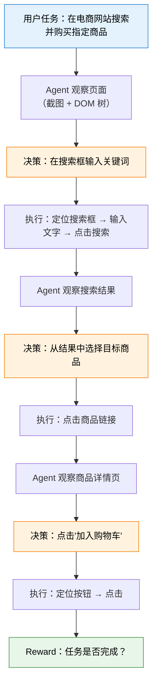

# 12.3 工具调用 RL：Web Agent 与 Code Agent

上一节我们拆解了多轮 RL 的信用分配问题——7 轮交互失败了，该怪谁。现在我们聚焦另一个关键问题：模型怎么学会"使用工具"？监督微调（SFT）可以教会模型"工具调用的 JSON 格式长什么样"，但教不会它"什么时候该调用工具、调哪个工具、怎么组合多个工具"。后者需要策略性的决策能力——而这正是 RL 擅长的。

## 为什么 RL 对工具调用至关重要？

想象你在训练一个模型帮用户做数据分析。SFT 阶段你给它看了上千个"正确调用工具"的示例，模型学会了：

```json
{"tool": "sql_query", "query": "SELECT * FROM users WHERE age > 30"}
```

它学会了这个格式。但到了实际使用时，模型面临的是策略性的决策：

- 用户问"我们的高端用户有多少"，模型需要决定：是直接查数据库？还是先搜索内部文档了解"高端用户"的定义？
- 查完数据库后发现有 10 万条记录，模型需要决定：是进一步筛选？还是做聚合统计？
- 聚合后发现数据异常，模型需要决定：是报告异常？还是尝试其他查询方式？

这些决策没有"标准答案"——不同的策略可能导致不同的结果，而 SFT 只能教模型模仿专家的轨迹，无法教它探索更优的策略。RL 的优势在于：你只需要告诉模型"最终结果对不对"，模型自己会通过试错学到"什么时候该用什么工具"。

|             | SFT                          | RL                                         |
| ----------- | ---------------------------- | ------------------------------------------ |
| 学什么      | 工具调用的语法格式           | 何时调用、调哪个、如何组合                 |
| 训练数据    | 需要人工标注的工具调用轨迹   | 只需要最终结果（成功/失败）作为 reward     |
| 泛化能力    | 只能处理见过的工具组合       | 能探索新的工具使用策略                     |
| 错误恢复    | 不会教模型从错误中恢复       | 模型通过试错学会修复策略                   |
| 代表工作    | Toolformer                   | ReTool、VERL-TOOL、ToolRL                  |

## 核心方法

### ReTool：推理中调用工具

ReTool（Reasoning with Tools）的思路是让模型在推理过程中**自由地**调用工具，而不是预先决定"什么时候调用"。模型在生成回答的过程中，随时可以"暂停"文本生成，调用一个工具（比如计算器或代码解释器），拿到结果后继续生成。

RL 的作用是优化"何时调用工具"的策略。模型可能发现：对于简单的算术题，直接口算比调用计算器更快；但对于复杂的数值计算，调用计算器更准确。这种"因地制宜"的策略，SFT 很难教会，RL 可以通过 reward 信号让模型自己摸索出来。

### VERL-TOOL：跨领域工具调用

VERL-TOOL 是一个跨领域的工具调用 RL 训练框架，覆盖数学推理、SQL 生成、Web 搜索、软件工程等多种场景。它的关键创新是**统一的工具调用接口**——不同领域的工具（计算器、数据库、搜索引擎）被抽象为统一的 RL 动作空间，可以用同一套 RL 算法训练。

### ToolRL：工具作为 RL 动作

ToolRL 将工具调用视为 RL 中的一个**特殊动作**，扩展策略的动作空间。标准 LLM 的动作空间是词汇表（几万个 token），ToolRL 在此基础上增加了"调用工具 A"、"调用工具 B"等动作。策略网络需要在"生成文本"和"调用工具"之间做出选择。

```python
class ToolAugmentedPolicy(nn.Module):
    """工具增强的策略网络：在文本生成和工具调用之间做选择"""

    def __init__(self, base_model, tools):
        super().__init__()
        self.base_model = base_model  # 基座 LLM
        self.tools = tools             # 可用工具列表

    def forward(self, state):
        """
        给定当前状态（对话历史 + 工具返回结果），
        决定下一步是生成文本还是调用工具
        """
        # 基座模型输出 logits
        logits = self.base_model(state)

        # 检测特殊的"工具调用 token"
        # 如果模型选择了工具调用 token，则解析参数并执行
        if self._is_tool_call(logits):
            tool_name, tool_args = self._parse_tool_call(logits)
            return ToolAction(tool_name, tool_args)
        else:
            return TextAction(logits)  # 正常文本生成
```

## 奖励设计：场景决定 Reward

工具调用的 reward 不像偏好对齐那样主观——它可以根据客观信号来设计。这实际上就是第 8 章提到的 **RLVR（Reinforcement Learning from Verifiable Rewards）** 在 Agentic 场景的直接应用。

| 场景     | Reward 来源              | 类型                     | 特殊考量                   |
| -------- | ------------------------ | ------------------------ | -------------------------- |
| 代码生成 | 单元测试通过率           | 连续（0-1）              | 部分通过也有部分 reward    |
| 数学推理 | 最终答案是否正确         | 二元（0/1）              | 中间步骤可用 PRM           |
| Web 搜索 | 是否找到正确答案         | 二元 + 路径效率惩罚      | 鼓励更少的搜索轮次         |
| SQL 生成 | 查询结果是否匹配预期     | 二元 + 执行时间惩罚      | 避免生成低效查询           |
| 数据分析 | 分析结论是否正确且完整   | 多维评分                 | 同时评估准确性和可读性     |

一个值得注意的模式：很多 Agentic 场景的 reward 都包含**效率惩罚**。这不只为了让模型更快，更因为每次工具调用都有成本（API 费用、延迟、资源消耗）。一个好的 Agent 不只是"能完成任务"，还要"高效地完成任务"。

形式化地，工具调用 RL 的总 reward 可以表示为：

$$R_{\text{total}} = R_{\text{task}} - \lambda_{\text{efficiency}} \cdot T - \lambda_{\text{format}} \cdot \mathbb{1}(\text{format error})$$

其中 $R_{\text{task}}$ 是任务完成奖励（0 或 1），$T$ 是使用的交互轮数，$\lambda_{\text{efficiency}}$ 是效率惩罚系数，$\lambda_{\text{format}}$ 是格式错误惩罚。这个公式把"成功完成任务"和"高效完成任务"统一到了一个 reward 信号中。

```python
def compute_agent_reward(task_success, num_turns, max_turns=10):
    """计算 Agentic RL 的综合 reward"""
    # 任务完成的基础 reward
    success_reward = 1.0 if task_success else 0.0

    # 效率惩罚：使用轮次越多，惩罚越大
    efficiency_penalty = -0.1 * (num_turns / max_turns)

    # 工具调用格式错误的额外惩罚
    # （如果模型生成了无法解析的工具调用）
    format_penalty = -0.5 if has_format_error else 0.0

    return success_reward + efficiency_penalty + format_penalty
```

## Web Agent RL：教模型上网

Web Agent 是 Agentic RL 最直观的应用之一：训练一个能够浏览网页、填写表单、搜索信息的智能体。这听起来简单，实现起来却充满了挑战。

**动作空间**。Web Agent 的动作不是"生成文本"，而是浏览器级别的操作：点击某个元素、在输入框中输入文字、滚动页面、导航到新 URL。每个动作都需要精确定位目标元素——这通常通过坐标（x, y）或 DOM 元素 ID 来实现。

**状态空间**。Web Agent 接收的状态通常是两部分：页面截图（视觉信息）和 DOM 树（结构信息）。截图提供了视觉布局，DOM 树提供了精确的元素定位。两者缺一不可——仅用截图很难精确点击小按钮，仅用 DOM 树又无法理解视觉布局。

**奖励信号**。Web Agent 的 reward 基于任务完成度。比如"在携程上预订一张明天北京到上海的机票"，reward 取决于：是否找到了正确的航班？是否成功填写了所有信息？是否提交了订单？



Web Agent RL 的主要挑战是状态空间的巨大规模和动态性。一个网页可能有上千个 DOM 元素，页面内容会动态加载，同一个网站在不同时间的布局可能不同。这意味着 Agent 需要强大的泛化能力——不能记住"某个按钮在屏幕左上角"，而是要理解"提交按钮通常长什么样"。

## Code Agent RL：写代码、调试、迭代

Code Agent RL 训练的是能够**写代码、执行代码、阅读报错、修复代码**的智能体。这比 Web Agent 更接近"真实程序员"的工作方式——不是一次性写出完美代码，而是通过"写 → 执行 → 报错 → 修复"的循环迭代来完成任务。

Code Agent 的 RL 训练有一个天然的优势：**reward 非常明确**。代码要么通过所有单元测试（reward = 1），要么不通过（reward < 1，按通过率给部分分）。这比 Web Agent 的"任务完成度"更容易量化和自动化。

```python
def code_agent_reward(generated_code, test_cases):
    """Code Agent 的 reward：基于测试通过率"""
    results = []
    for test_input, expected_output in test_cases:
        try:
            # 在沙箱中执行生成的代码
            actual_output = execute_in_sandbox(generated_code, test_input)
            results.append(actual_output == expected_output)
        except Exception:
            results.append(False)  # 执行异常 = 测试不通过

    # 基础 reward = 通过率
    pass_rate = sum(results) / len(results)

    # 额外奖励：代码简洁性（越短越好，但有最低要求）
    # 额外惩罚：执行时间过长
    return pass_rate
```

Code Agent RL 的一个关键发现来自 ICML 2025 的研究：**单步 reward 可以有效引导多轮代码生成**。也就是说，你不需要对每一轮的"写代码 → 执行 → 报错 → 修复"过程都给 reward——只需要给最终代码是否通过测试这一个信号，模型就能学会"写出正确的代码 → 修复错误"的完整策略。这和上一节的 ORM 思路一致——如果 reward 足够明确，稀疏信号也能工作。

<details>
<summary>思考题：Web Agent 和 Code Agent 的 reward 设计有什么本质区别？这对 RL 训练策略有什么影响？</summary>

Web Agent 的 reward 通常是**二元且不可分**的——要么任务完成了，要么没完成，中间状态很难量化。这导致 reward 信号极度稀疏，训练难度大。

Code Agent 的 reward 是**可分的**——10 个单元测试过了 7 个，reward = 0.7。这种连续的 reward 信号让训练更容易：即使代码不完全正确，模型也能得到"方向对了"的信号。这就是为什么 Code Agent RL 的进展比 Web Agent RL 快得多。

对训练策略的影响是：Web Agent RL 更需要 PRM（每步评估）来提供密集信号，而 Code Agent RL 用 ORM（只看最终测试结果）就能取得不错的效果。
</details>

## 工具调用策略的训练流程

把上面的概念串起来，一个完整的工具调用 RL 训练流程通常包含三个阶段：

**阶段一：SFT 教格式。** 用人类标注的工具调用轨迹做监督微调，教会模型"工具调用的 JSON 格式长什么样"。这一步不涉及策略优化——模型只是学会了如何正确地格式化一个工具调用请求。

**阶段二：RL 教策略。** 在 SFT 模型的基础上，用 RL 优化工具使用的策略。模型开始探索不同的工具使用方式——有时候该调工具却不调，有时候不该调却调了。Reward 信号（任务成功/失败）告诉模型哪种策略更好。

**阶段三：迭代优化。** 随着 RL 训练的进行，模型会发现自己策略中的弱点——比如"在某些场景下总是忘记先搜索再回答"。这些弱点可以通过增加针对性的训练数据来修复，形成一个持续改进的循环。

```python
# 简化的工具调用 RL 训练循环
def tool_rl_training_loop(
    model, tool_env, tasks, num_epochs=100, group_size=4
):
    """工具调用 RL 的核心训练循环（简化版）"""
    optimizer = torch.optim.Adam(model.parameters(), lr=1e-6)

    for epoch in range(num_epochs):
        for task in tasks:
            # 生成多条轨迹（group sampling，类似 GRPO）
            trajectories = []
            for _ in range(group_size):
                traj = model.interact_with_tools(task, tool_env)
                trajectories.append(traj)

            # 计算每条轨迹的 reward
            rewards = [compute_agent_reward(t.success, t.num_turns) for t in trajectories]

            # 组内比较（GRPO 思路）：用相对排名来计算 advantage
            mean_reward = np.mean(rewards)
            std_reward = np.std(rewards) + 1e-8
            advantages = [(r - mean_reward) / std_reward for r in rewards]

            # 策略梯度更新
            for traj, advantage in zip(trajectories, advantages):
                loss = traj.total_log_prob * (-advantage)  # 策略梯度
                loss.backward()

            optimizer.step()
            optimizer.zero_grad()
```

注意这个训练循环的核心思路和第 8 章的 GRPO 非常相似——都是"组内采样多条轨迹，用相对比较来计算 advantage"。区别在于：GRPO 比较的是多条文本回答，这里比较的是多条工具调用轨迹。

## 与 RLVR 的联系

你可能已经注意到，工具调用 RL 的 reward 设计和第 8 章的 RLVR 非常相似。这不是巧合——**Agentic RL 就是 RLVR 在多轮交互场景的自然延伸**。RLVR 的核心思想是"用可验证的结果作为 reward，不需要训练 Reward Model"。在工具调用场景中，工具的执行结果天然就是可验证的：代码是否通过测试、SQL 查询结果是否正确、搜索结果是否包含目标信息——这些都可以自动化验证，不需要人工标注。

这也是为什么 Agentic RL 被认为比偏好对齐（RLHF/DPO）更适合 Agent 训练的原因之一：偏好对齐需要训练一个 Reward Model 来模拟人类偏好，而 Agent 的任务通常有客观的评判标准，直接用可验证奖励就可以了。

<details>
<summary>思考题：SFT 教格式 + RL 教策略的两阶段范式，和第 2 章的 DPO 有什么异同？</summary>

相同之处在于两者都是"先 SFT 再 RL"——先用监督学习教模型基本的格式和能力，再用 RL 优化策略。这是大模型训练的通用范式。

不同之处在于目标：DPO 的 RL 阶段优化的是"回答的偏好排序"（人类更喜欢哪个回答），而工具调用 RL 的 RL 阶段优化的是"工具使用策略"（什么时候该用什么工具）。前者需要 Reward Model（或隐式的偏好模型），后者可以用可验证奖励（不需要额外的 Reward Model）。

更深层的区别是：DPO 依然在单轮范式中——输入 prompt，输出完整回答。工具调用 RL 在多轮范式中——模型需要在多步交互中做出连续决策。这使得后者面临更复杂的信用分配问题（上一节讨论的核心难题）。
</details>

下一节我们来聊聊 Agentic RL 的工程挑战和评估体系——[如何把这一切跑起来并衡量效果](./agentic-engineering)。

## 参考资料

- Schick T, Dwivedi-Lynch B, et al. "[Toolformer: Language Models Can Teach Themselves to Use Tools](https://arxiv.org/abs/2302.04761)." NeurIPS 2023. —— SFT 教工具调用格式的代表工作，证明 LLM 可以自学使用工具。
- An Y, Wang B, Zhang Z, et al. "[ReTool: Reinforcement Learning for Strategic Tool Use in LLMs](https://arxiv.org/abs/2504.11536)." arXiv:2504.11536, 2025. —— 用 RL 优化推理过程中的工具调用策略。
- Chen K, Liu T, Yang T, et al. "[ToolRL: Reward is All Tool Learning Needs](https://arxiv.org/abs/2504.13958)." arXiv:2504.13958, 2025. —— 将工具调用视为 RL 中的特殊动作，扩展策略的动作空间。
- verl-tool Team. "[verl-tool](https://github.com/volcengine/verl-tool)." GitHub, 2025. —— VeRL 的工具调用增强版，跨领域工具调用 RL 训练框架。
